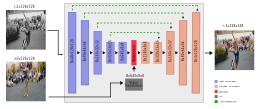

# Enhancing Video Colorization with Deep Learning: A Comprehensive Analysis of Training Loss Functions
<!--  -->


## Description
This repository contains research on using deep neural networks to automatically colorize black-and-white videos, enhancing our experience of historical films and providing powerful tools for filmmakers. The approach extends image colorization techniques to video by using diffusion models to introduce noise into frames and a U-Net with self-attention layers to predict the denoised, colorized frames. Training was conducted using the DAVIS and LDV datasets, achieving state-of-the-art results in video colorization across several quality metrics, including PSNR, SSIM, FID, and CDC, as demonstrated at the NTIRE 2023 video colorization challenge.

The article can be found here: [Enhancing Video Colorization with Deep Learning: A Comprehensive Analysis of Training Loss Functions](https://link.springer.com/chapter/10.1007/978-3-031-66329-1_32)

## Requirement
- `torch` >= 1.13
- `torchvision` >= 0.4
- `cuda` >= 11.6
- `vit Pytorch` >= 0.40.2

## Network Topology



## Results

This section displays qualitative results through images of various loss function combinations, highlighting visual quality and artifacts. Quantitative results are summarized with metrics like SSIM, PSNR, and LPIPS, providing a detailed performance evaluation of each configuration.

## Visual Results
| $S_g$                             | MAE + SSIM                     | MSE + SSIM                     | MAE + Content                  | MSE + Content                  |
|-----------------------------------|--------------------------------|--------------------------------|--------------------------------|--------------------------------|
|              |  |  |  |  |

| $R$                               | MAE + LPIPS                    | MSE + LPIPS                    | MAE + Perceptual               | MSE + Perceptual               |
|-----------------------------------|--------------------------------|--------------------------------|--------------------------------|--------------------------------|
|                |  |  |  |  |

## Results: Combined Loss Functions

| **Number of Loss Functions** | **Training Loss Functions**   | **SSIM ↑** | **PSNR ↑** | **LPIPS ↑** |
|------------------------------|------------------------------|------------|------------|-------------|
| Single                       | MSE                          | 0.970      | 45.460     | 0.021       |
| Single                       | MAE                          | 0.970      | 44.225     | 0.023       |
| Two                          | MAE + SSIM                   | 0.967      | 41.944     | 0.024       |
| Two                          | MSE + SSIM                   | 0.973      | 48.099     | 0.021       |
| Two                          | MAE + Content                | 0.972      | 46.999     | 0.022       |
| Two                          | MSE + Content                | 0.953      | 33.981     | 0.041       |
| Two                          | MSE + LPIPS                  | 0.962      | 40.570     | 0.028       |
| Two                          | MAE + LPIPS                  | 0.965      | 42.585     | 0.026       |
| Two                          | MAE + Perceptual             | 0.967      | 43.570     | 0.023       |
| Two                          | MSE + Perceptual             | 0.970      | 46.496     | 0.020       |
| Three                        | MAE + SSIM + Perceptual      | 0.975      | 49.532     | 0.026       |
| Three                        | MSE + SSIM + Perceptual      | 0.975      | 49.532     | 0.026       |
| Three                        | MSE + LPIPS + SSIM           | 0.974      | 49.132     | 0.024       |
| Three                        | MAE + LPIPS + SSIM           | 0.968      | 44.883     | 0.023       |
| Three                        | MAE + LPIPS + Content        | 0.961      | 39.772     | 0.030       |
| Three                        | MSE + LPIPS + Content        | 0.970      | 47.040     | 0.019       |
| Three                        | MAE + SSIM + LPIPS           | 0.966      | 40.183     | 0.026       |
| Three                        | MSE + SSIM + LPIPS           | 0.974      | 48.691     | 0.024       |
| Three                        | MAE + SSIM + Style           | 0.971      | 43.463     | 0.025       |
| Three                        | MSE + SSIM + Style           | 0.974      | 47.653     | 0.023       |

## Datasets

Two datasets are utilized in the training process, the [DAVIS 2017 (Densely Annotated VIdeo Segmentation)](https://davischallenge.org/) to training the weights and to validate the results of the model.

## Data Format

The input to colorize inference needs to be an monocromatic video and an example frame (preference of this video).
The code will resize and normalize the frames to predict the color. At the end, the video colorized will be saved at the `videos_output` folder.

## Evaluation

To evalute the mode execute the file `main.py` and put in the variable `str_dt` one of the model name in the folder `trained_models`.

Also, if you want to train yout own model using the losses combination you just need to run the `loop_train_all_losses.py`, this script execute the `train.py` for each loss combionation defined in the `criterions` list.

## Citation
```
@InProceedings{stival2024enhancing,
author="Stival, Leandro and da Silva Torres, Ricardo and Pedrini, Helio",
editor="Arai, Kohei",
title="Enhancing Video Colorization with Deep Learning: A Comprehensive Analysis of Training Loss Functions",
booktitle="Intelligent Systems and Applications",
year="2024",
publisher="Springer Nature Switzerland",
address="Cham",
pages="496--509",
isbn="978-3-031-66329-1"
}
```

<!-- ## Usage
```python
from lpips_pytorch import LPIPS, lpips

# define as a criterion module (recommended)
criterion = LPIPS(
    net_type='alex',  # choose a network type from ['alex', 'squeeze', 'vgg']
    version='0.1'  # Currently, v0.1 is supported
)
loss = criterion(x, y) -->
